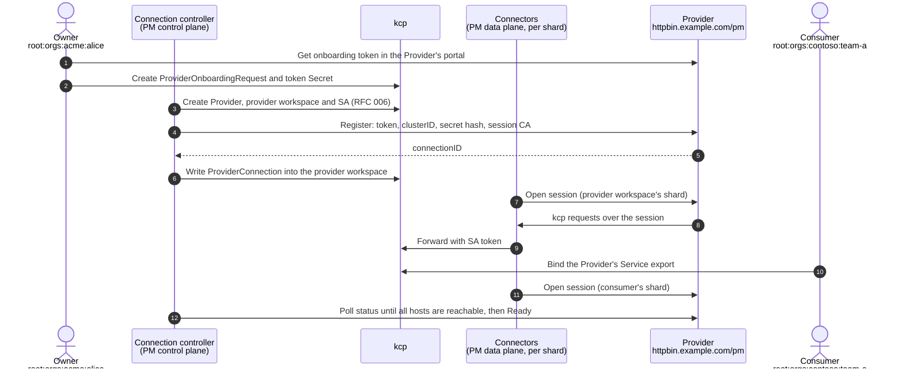
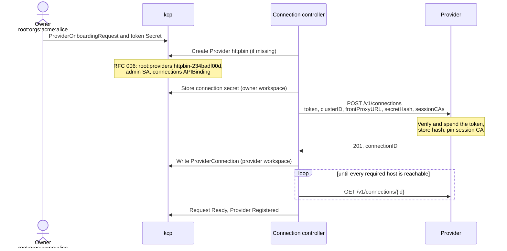
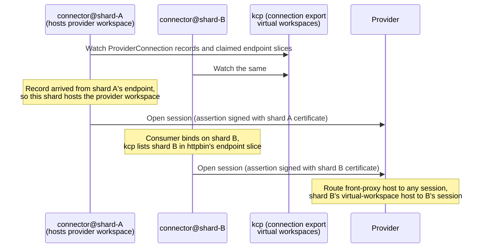
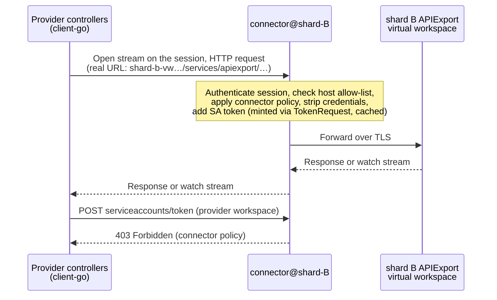
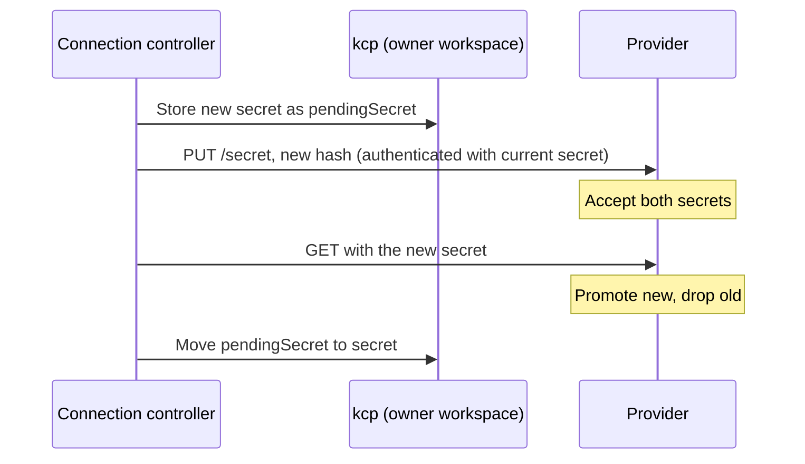
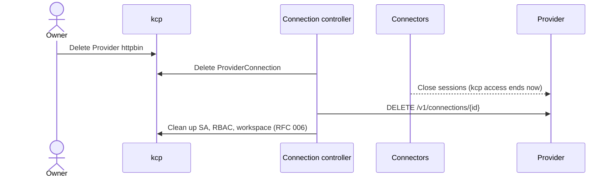
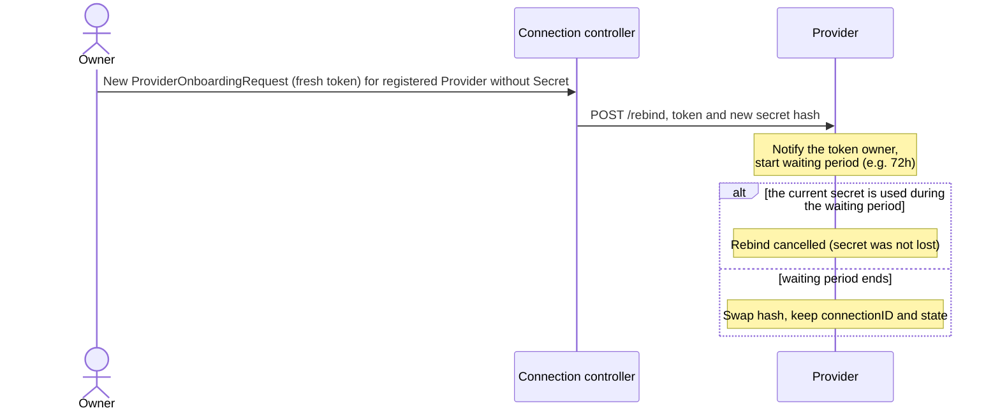

# RFC 011: Provider onboarding and connectivity

| Status | Date |
|---|---|
| Draft (work in progress) | 2026-10-09 |

Continues [RFC 006](./006_provider-bootstrap-operator.md). Design history and rejected alternatives: [notes v1–v5](./xxx-notes-011-provider-onboarding-flow-improvements-v5.md).

## Summary

An externally run service Provider is onboarded into a Platform Mesh (PM) instance with a one-time token from the Provider's portal. Afterwards PM connects **out** to the Provider and serves the Provider's kcp requests through an authenticating proxy. The Provider never holds kcp credentials, can serve any number of PM instances, and needs nothing but an HTTPS endpoint that accepts WebSockets.

## Motivation

Today (RFC 006) a Provider is bound to one PM instance, receives a static ServiceAccount token, and needs network access to kcp. That rules out PM instances behind NAT, makes revocation depend on token expiry, and requires manual copying of kubeconfigs.

## Parties and workspaces

| Party | Who | Example home |
|---|---|---|
| **Owner** | PM user who onboards a Provider | workspace `root:orgs:acme:alice`, holding the `Provider` object |
| **Provider** | the external service provider | its runtime at `https://httpbin.example.com/pm`, and its **provider workspace** `root:providers:httpbin-234badf00d` (created by PM, RFC 006), where it is admin and publishes its Service APIExports |
| **Consumers** | PM users of the Provider's service | `root:orgs:contoso:team-a` (shard B), `root:orgs:fabrikam:dev` (shard C), each with an APIBinding to the Service export |
| **PM** | the PM instance | **connection controller** (control plane) and one **connector** per kcp shard (data plane), both in the hosting cluster; PM APIs exported from `root:platform-mesh-system` |

## Design

- **PM dials out.** Every connection between PM and a Provider is opened by PM, so PM may sit behind NAT.
- **No kcp credential leaves PM.** Connectors proxy the Provider's kcp requests and add a short-lived ServiceAccount token themselves. Closing the sessions ends access immediately.
- **Two credentials, two planes.**
  - A **connection secret**, generated by PM and stored hashed by the Provider, authenticates rare **control calls** made by the connection controller.
  - Short-lived **session assertions**, signed with short-lived per-shard certificates from a **session CA** that each connection pins at registration, authenticate **sessions**.
- **Sessions only where needed.** A connector opens a session for a connection on its shard if the provider workspace lives there (for front-proxy traffic) or if the shard appears in the connection's Service APIExportEndpointSlices (i.e. has consumers).
- **Connector policy.** The Provider is admin in its workspace, but its only path into kcp is the connector, which denies the few operations that would affect PM (see "Security").

### High-level flow



## APIs

### PM-side resources

```yaml
# --- Owner workspace root:orgs:acme:alice ---------------------------------
apiVersion: v1
kind: Secret
metadata: { name: httpbin-token }
stringData:
  token: pm1.aHR0cHM6Ly9odHRwYmluLmV4YW1wbGUuY29tL3Bt.t0k3n1d.s3cr3t   # URL is inside the token
---
apiVersion: providers.platform-mesh.io/v1alpha1
kind: ProviderOnboardingRequest                # short-lived; garbage-collected after Ready
metadata: { name: httpbin-2026-10-09 }
spec:
  tokenSecretRef: { name: httpbin-token, key: token }
  provider: { name: httpbin }                  # created if missing; rebinds if registered but its Secret is lost
status:
  phase: Ready                                 # WaitingForProvider → Registering → VerifyingKcp → Ready | Failed
  connectionID: c-7f3a
---
apiVersion: providers.platform-mesh.io/v1alpha1
kind: Provider
metadata: { name: httpbin }
spec:
  remote: {}                                   # an externally run Provider (no static kubeconfig)
status:
  connection: { url: https://httpbin.example.com/pm, connectionID: c-7f3a }
  conditions:                                  # aggregate only; nothing names shards
    - { type: Registered, status: "True" }
    - { type: SessionsConnected, status: "True" }
    - { type: KcpReachable, status: "True" }
---
apiVersion: v1
kind: Secret                                   # read only by the connection controller
metadata:
  name: httpbin-connection
  ownerReferences: [ { apiVersion: providers.platform-mesh.io/v1alpha1, kind: Provider, name: httpbin } ]
stringData:
  url: https://httpbin.example.com/pm
  connectionID: c-7f3a
  secret: pmc1_Xq3…                            # connection secret; the Provider stores only its hash

# --- PM workspace root:platform-mesh-system ------------------------------
---
apiVersion: apis.kcp.io/v1alpha2
kind: APIExport
metadata: { name: connections.platform-mesh.io }
spec:
  resources:
    - { group: connections.platform-mesh.io, name: providerconnections, schema: … }
  permissionClaims:                            # the only claim: read endpoint slices in the provider workspace
    - { group: apis.kcp.io, resource: apiexportendpointslices, verbs: [ get, list, watch ] }

# --- Provider workspace root:providers:httpbin-234badf00d (shard A) --------
---
apiVersion: apis.kcp.io/v1alpha2
kind: APIBinding                               # created by PM with the workspace
metadata: { name: connections }
spec:
  reference: { export: { path: root:platform-mesh-system, name: connections.platform-mesh.io } }
  permissionClaims:
    - { group: apis.kcp.io, resource: apiexportendpointslices, verbs: [ get, list, watch ], state: Accepted, selector: { matchAll: true } }
---
apiVersion: connections.platform-mesh.io/v1alpha1
kind: ProviderConnection                       # written by PM only (connector policy); name TBD, see open questions
metadata: { name: connection }
spec:
  connectionID: c-7f3a
  url: https://httpbin.example.com/pm
  serviceAccount: { namespace: default, name: provider-admin }
---
apiVersion: apis.kcp.io/v1alpha2
kind: APIExport                                # the Provider's own Service export
metadata: { name: httpbin.example.io }
---
apiVersion: apis.kcp.io/v1alpha1
kind: APIExportEndpointSlice                   # status lists the shards that have consumers (kcp-maintained)
metadata: { name: httpbin.example.io }
spec: { export: { name: httpbin.example.io } }

# --- Consumer workspace root:orgs:contoso:team-a (shard B) -----------------
---
apiVersion: apis.kcp.io/v1alpha2
kind: APIBinding
metadata: { name: httpbin }
spec:
  reference: { export: { path: root:providers:httpbin-234badf00d, name: httpbin.example.io } }

# --- Hosting cluster (PM), per shard ---------------------------------------
---
apiVersion: cert-manager.io/v1
kind: Certificate                              # shard certificate, mounted into connector@shard-b
metadata: { name: connector-shard-b }
spec:
  secretName: connector-shard-b-cert
  duration: 24h
  renewBefore: 8h
  privateKey: { algorithm: ECDSA, size: 256, rotationPolicy: Always }
  usages: [ digital signature ]
  uris: [ "https://shard-b-vw.kcp.example.com:6443" ]   # the host its sessions serve
  issuerRef: { name: session-ca-2026, kind: Issuer }    # an immutable CA generation, pinned by every connection
```

### Provider-side connection API

Served by the Provider SDK at the base URL from the token, plain HTTPS.

```
POST   /v1/connections                 Bearer <onboarding token>     register: {idempotencyKey, clusterID, frontProxyURL, secretHash, sessionCAs} → {connectionID}
GET    /v1/connections/{id}            Bearer <connection secret>    status per required host
PUT    /v1/connections/{id}/secret     Bearer <connection secret>    rotate the connection secret (pending until first use)
PUT    /v1/connections/{id}/session-cas Bearer <connection secret>   pin the current and next session CA generation
POST   /v1/connections/{id}/rebind     Bearer <onboarding token>     recover a lost secret, after a waiting period
DELETE /v1/connections/{id}            Bearer <connection secret>    offboard
GET    /v1/connections/{id}/session    Bearer <session assertion>    WebSocket; stream multiplexer inside
```

A session assertion is a JWT (≤ 5 min) with the shard certificate in `x5c` and the claims `aud` (this session URL), `cluster` (the provider workspace's `clusterID`), `iat`, `exp`, `jti`. The Provider verifies the chain against the pinned session CAs, the signature, the audience, the lifetime, replay, and that `cluster` matches the `clusterID` from registration.

## Flows

### Registration



### Sessions and discovery



### A proxied request



### Connection secret rotation



Shard certificates renew automatically under the same pinned CA. A new session CA generation is pinned on every connection (`PUT /session-cas`) before shard certificates switch to it, and unpinned after the old ones expire.

### Offboarding



### Recovery after a lost connection secret



## Security

**Trust boundaries.** The owner's workspace is the owner's responsibility; the Provider's edge (ingress, CDN) is the Provider's. Within those, nothing else can take over a connection, no kcp credential leaves PM, and a Provider can't affect PM from within its workspace.

**Connector policy.** The connector is the Provider's only path into kcp. Besides restricting the connection to its own provider workspace and its own exports' virtual-workspace endpoints, it denies:

| Denied | Why |
|---|---|
| Writes to `providerconnections` | Records stay PM-written |
| `update`, `patch`, `delete` on the `connections` APIBinding | Binding and claim stay in place |
| Writes to `apiexportendpointslices/status` | Session placement can't be forged |
| `create` on `serviceaccounts/token`, CSR creation and approval | No kcp credential can be minted and kept |
| `exec`, `attach`, `port-forward` | Not needed to reconcile an APIExport |

This requires that PM gives a remote Provider no other credential (no static kubeconfig).

**Credentials.**

| Credential | Held by | Lifetime | If leaked |
|---|---|---|---|
| Onboarding token | owner (Secret), until spent | minutes, single use | registers a new connection only; can't touch existing ones |
| Connection secret | connection controller (owner's workspace) | rotated automatically | control calls for one connection; no kcp access |
| Shard certificate | connector, per shard | ~24h | sessions on one shard, fake data only, until expiry |
| Session CA | control plane (ideally KMS/Vault) | one immutable generation | sessions everywhere, fake data only, until unpinned or expired |
| SA token | connector memory | short | admin in one provider workspace; never sent to the Provider |

## Alternatives considered

See the notes for details.
- **Delivering kcp credentials to the Provider** (v1–v4), with inner mTLS (v4): heavy on every Provider; tokens outlive revocation.
- **One connector for all shards; sessions on every shard; `/services/admin` for discovery**: no load scaling, idle sessions, exposed topology.
- **Records in owners' `Provider` objects, a PM-internal workspace, or the cache (`ClusterCachedResource`)**: owner-editable, away from the shards, or broader credentials.
- **Restricting the Provider's RBAC, or signing records**: unknown Provider needs, or extra key management, where the connector policy suffices.
- **Pinning the session CA's bare public key**: loses expiry, constraints and standard verification.

## Open questions

- Proxying at scale (memory and goroutines per watch, relist bursts) and the multiplexer (remotedialer vs. yamux).
- Permission claims on `apiexportendpointslices`; legacy SA-token Secrets; duplicate bindings.
- Naming: pm-operator already has a `ProviderConnection` type.
- Keeping kcp-operator's cache-server credentials out of connector pods.
- Provider-side multi-replica routing; egress rules for connector dials; `direct` mode.
